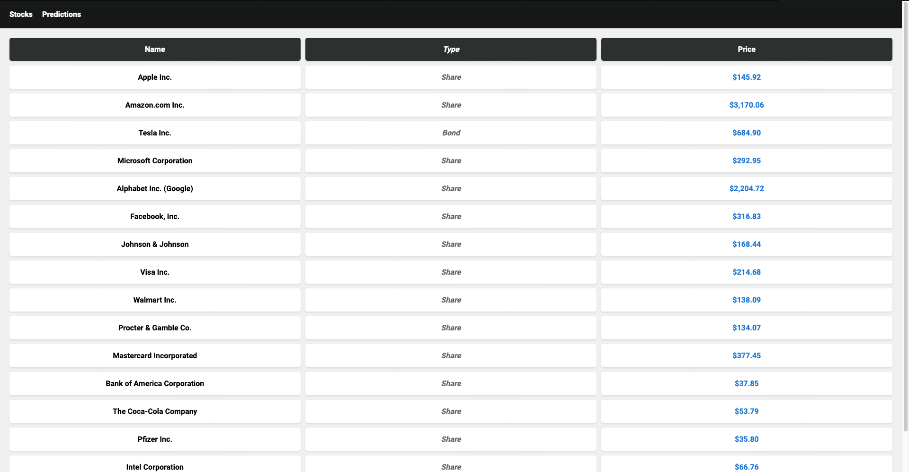

# StockTr

Otus kotlin course education project.

Your ultimate investment companion called StockTr. Take control of your investments with StockTr, the premier platform for tracking stock values and harnessing the power of AI for predictive analysis.

## User Interface

## Documentation

1. Marketing
    1. [Target Audience](./docs/marketing/target-audience.md)
    2. [Stakeholders](./docs/marketing/stakeholders.md)
    3. [User Stories](./docs/marketing/user-stories.md)
2. Analytics
    1. [Functional Requirements](./docs/analisys/functional-requirements.md)
    2. [Non-functional Requirements](./docs/analisys/non-functional-requirements.md)
3. DevOps
    1. [Deploy](./marketplace-be/docker)
4. Architecture
    1. [API](./docs/architecture/api.md)
    2. [Component Design](./docs/architecture/architecture.md)